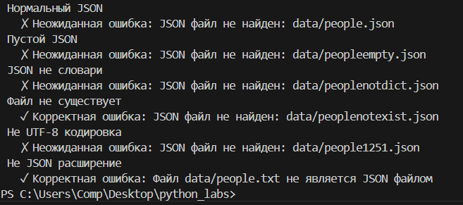
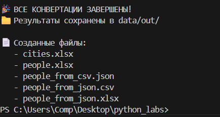
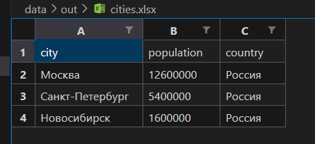
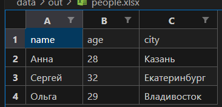
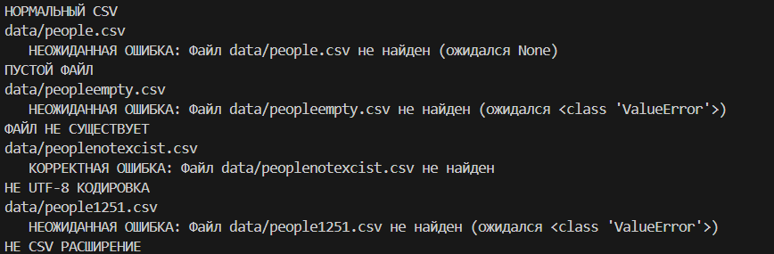

## ЛАБОРАТОРНАЯ РАБОТА 5
### Задание 1
### функции
```python
import json
import csv
import os

def json_to_csv(json_path: str, csv_path: str) -> None:
    if not json_path.lower().endswith('.json'):
        raise ValueError(f"Файл {json_path} не является JSON файлом")
    
    if not os.path.exists(json_path):
        raise FileNotFoundError(f"JSON файл не найден: {json_path}")
    
    try:
        with open(json_path, 'r', encoding="UTF-8") as json_file:
            content = json_file.read().strip()
            
            if not content:
                raise ValueError(f"JSON файл пуст: {json_path}")
            
            data = json.loads(content)
            
    except UnicodeDecodeError:
        raise ValueError(f"Файл {json_path} имеет неверную кодировку (требуется UTF-8)")
    except json.JSONDecodeError as e:
        raise ValueError(f"Невалидный JSON в файле {json_path}: {e}")
    
    if not isinstance(data, list):
        raise ValueError("JSON должен содержать список")
    
    if not data:
        raise ValueError("JSON должен содержать непустой список")
    
    for item in data:
        if not isinstance(item, dict):
            raise ValueError("Все элементы в JSON должны быть словарями")
    
    all_columns = []
    for item in data:
        for key in item.keys():
            if key not in all_columns:
                all_columns.append(key)
    
    with open(csv_path, 'w', encoding="UTF-8", newline='') as csv_file:
        writer = csv.DictWriter(csv_file, fieldnames=all_columns)
        writer.writeheader()
        for row in data:
            full_row = {}
            for column in all_columns:
                full_row[column] = row.get(column, '')
            writer.writerow(full_row)

def csv_to_json(csv_path: str, json_path: str) -> None:

    if not csv_path.lower().endswith('.csv'):
        raise ValueError(f"Файл {csv_path} не является CSV файлом")
    
    if not os.path.exists(csv_path):
        raise FileNotFoundError(f"CSV файл не найден: {csv_path}")
    
    try:
        with open(csv_path, 'r', encoding="UTF-8") as csv_file:
            content = csv_file.read().strip()
            
            if not content:
                raise ValueError(f"CSV файл пуст: {csv_path}")
            
            csv_file.seek(0)
            reader = csv.DictReader(csv_file)
            
            if not reader.fieldnames:
                raise ValueError("CSV файл не содержит заголовка")
            
            data = []
            for row in reader:
                str_row = {}
                for key, value in row.items():
                    str_row[key] = str(value)
                data.append(str_row)
            
            if not data:
                raise ValueError("CSV файл не содержит данных")
                
    except UnicodeDecodeError:
        raise ValueError(f"Файл {csv_path} имеет неверную кодировку (требуется UTF-8)")
    except csv.Error as e:
        raise ValueError(f"Невалидный CSV в файле {csv_path}: {e}")
    
    with open(json_path, 'w', encoding="UTF-8") as json_file:
        json.dump(data, json_file, ensure_ascii=False, indent=2)
    
```
### тесты
```python
    test_cases = [
        #(функция, аргументы, ожидаемая_ошибка, описание)
        (json_to_csv, ("data/people.json", "data/people.csv"), None, "Нормальный JSON"),
        (json_to_csv, ("data/peopleempty.json", "data/people2.csv"), ValueError, "Пустой JSON"),
        (json_to_csv, ("data/peoplenotdict.json", "data/people2.csv"), ValueError, "JSON не словари"),
        (json_to_csv, ("data/peoplenotexist.json", "data/people2.csv"), FileNotFoundError, "Файл не существует"),
        (json_to_csv, ("data/people1251.json", "data/people2.csv"), ValueError, "Не UTF-8 кодировка"),
        (json_to_csv, ("data/people.txt", "data/people2.csv"), ValueError, "Не JSON расширение"),
        ]
    
```


## Задание 2
```python
import csv
import os
from openpyxl import Workbook
from openpyxl.utils import get_column_letter


def csv_to_xlsx(csv_path: str, xlsx_path: str) -> None:

    if not os.path.exists(csv_path):
        raise FileNotFoundError(f"Файл {csv_path} не найден")

    if not csv_path.lower().endswith('.csv'):
        raise ValueError(f"Файл {csv_path} не является CSV файлом")
    
    data = []
    
    try:
        with open(csv_path, 'r', encoding='utf-8') as csv_file:
            content = csv_file.read().strip()
            if not content:
                raise ValueError(f"Файл {csv_path} пуст")
            
            csv_file.seek(0) 
            reader = csv.reader(csv_file)
            
            for row in reader:
                data.append(row)
                
    except UnicodeDecodeError:
        raise ValueError(f"Файл {csv_path} имеет неверную кодировку (требуется UTF-8)")
    except csv.Error as e:
        raise ValueError(f"Невалидный CSV в файле {csv_path}: {e}")
    
    if not data:
        raise ValueError(f"CSV файл {csv_path} не содержит данных")

    wb = Workbook()
    ws = wb.active
    ws.title = "Sheet1"
    
    for row_idx, row_data in enumerate(data, 1):
        for col_idx, cell_value in enumerate(row_data, 1):
            ws.cell(row=row_idx, column=col_idx, value=cell_value)
    
    for col_idx in range(1, len(data[0]) + 1):
        column_letter = get_column_letter(col_idx)
        max_length = 8  
        
        for row_idx in range(1, len(data) + 1):
            cell_value = ws.cell(row=row_idx, column=col_idx).value
            if cell_value:
                max_length = max(max_length, len(str(cell_value)))
        
        ws.column_dimensions[column_letter].width = max_length + 2 
    
    wb.save(xlsx_path)


        
```




### проверка ошибок 
### тесты
```python
test_cases = [
        #(аргументы, ожидаемая_ошибка, описание)
        (("data/people.csv", "data/people.xlsx"), None, "НОРМАЛЬНЫЙ CSV"),
        (("data/peopleempty.csv", "data/people2.xlsx"), ValueError, "ПУСТОЙ ФАЙЛ"),
        (("data/peoplenotexcist.csv", "data/people2.xlsx"), FileNotFoundError, "ФАЙЛ НЕ СУЩЕСТВУЕТ"),
        (("data/people1251.csv", "data/people2.xlsx"), ValueError, "НЕ UTF-8 КОДИРОВКА"),
        (("data/people.txt", "data/people2.xlsx"), ValueError, "НЕ CSV РАСШИРЕНИЕ"),
    ]
```

##### надеюсь все работает успешно(поставьте 5)