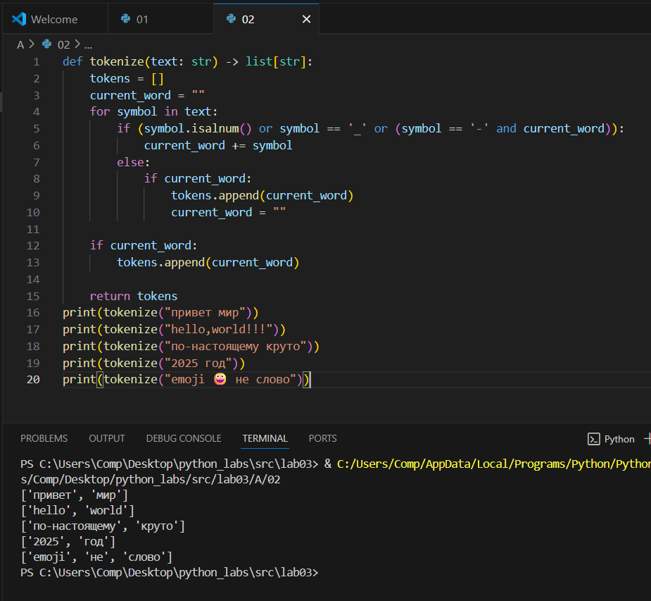
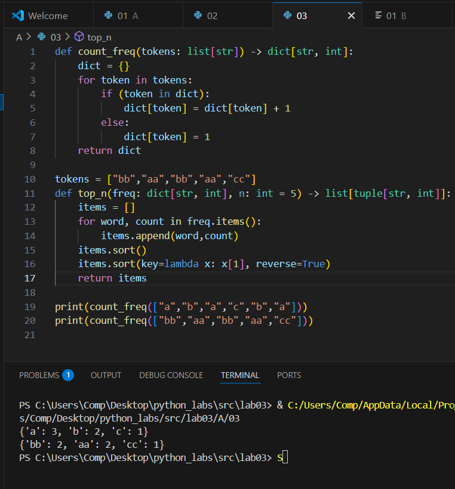
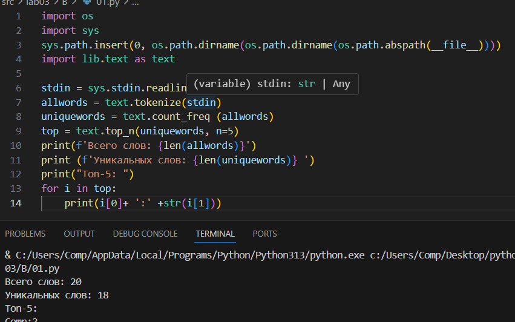

## Лабораторная №3
## python
## Задание normalize
``` python
def normalize(text: str, *, casefold: bool = True, yo2e: bool = True) -> str:
    text = text.replace("\r", " ")
    text = text.replace("\t", " ")
    text = text.replace("\n", " ")
    
    if (yo2e == True):
        text = text.replace("ё", "е")
        text = text.replace("Ё", "Е")
        
    if (casefold == True):
        text = text.casefold()
        
    while ("  " in text):
        text = text.replace("  ", " ")
    text = text.strip()

    return text 
```


## Задание tokenize
```python
def tokenize(text: str) -> list[str]:
    tokens = []
    current_word = ""
    for symbol in text:
        if (symbol.isalnum() or symbol == '_' or (symbol == '-' and current_word)):
            current_word += symbol
        else:
            if current_word:
                tokens.append(current_word)
                current_word = ""

    if current_word:
        tokens.append(current_word)
    
    return tokens
```


## Задание count_freq+top_n
```python
def count_freq(tokens: list[str]) -> dict[str, int]:
    dict = {}
    for token in tokens:
        if (token in dict):
            dict[token] = dict[token] + 1
        else:
            dict[token] = 1
    return dict

def top_n(freq: dict[str, int], n: int = 5) -> list[tuple[str, int]]:
    items = []
    for word, count in freq.items():
        items.append(word,count)
    items.sort()
    items.sort(key=lambda x: x[1], reverse=True)
    return items
```


## Задание В
```python
import os
import sys 
sys.path.insert(0, os.path.dirname(os.path.dirname(os.path.abspath(__file__))))
import lib.text as text

stdin = sys.stdin.readline()
allwords = text.tokenize(stdin)
uniquewords = text.count_freq (allwords)
top = text.top_n(uniquewords, n=5)
print(f'Bcero слов: {len(allwords)}')
print (f'Уникальных слов: {len(uniquewords)} ')
print("Ton-5: ")
for i in top:
    print(i[0]+ ':' +str(i[1]))
```
